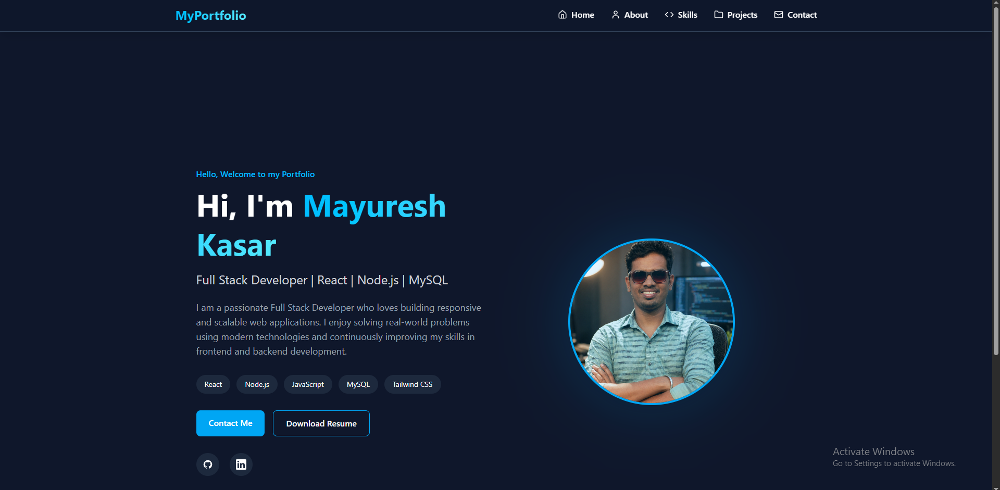
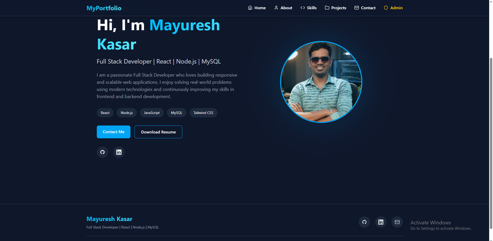
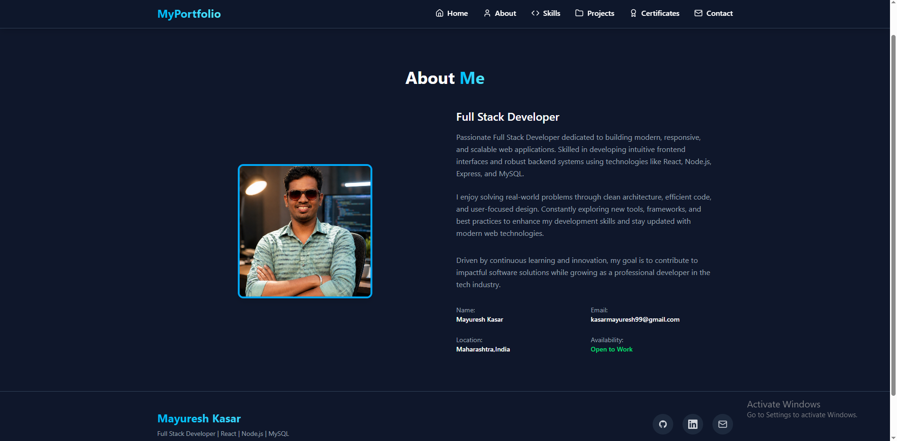
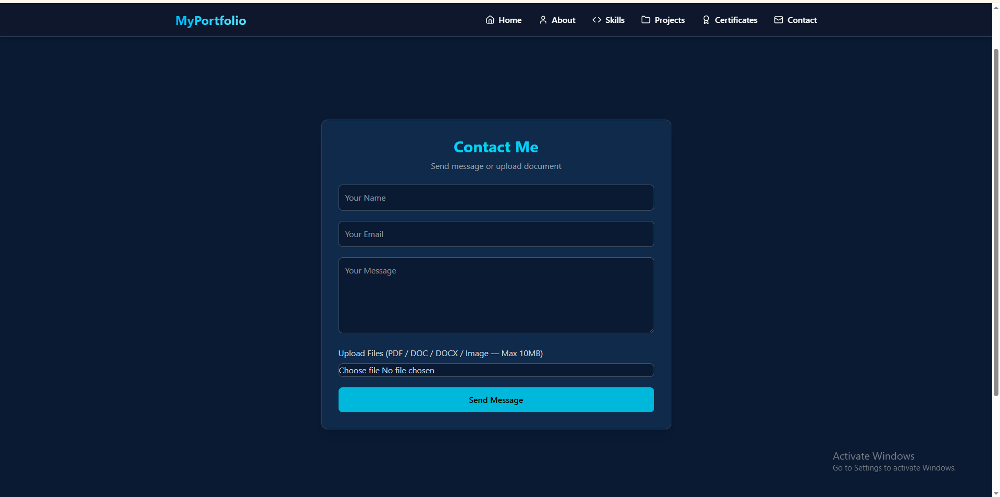
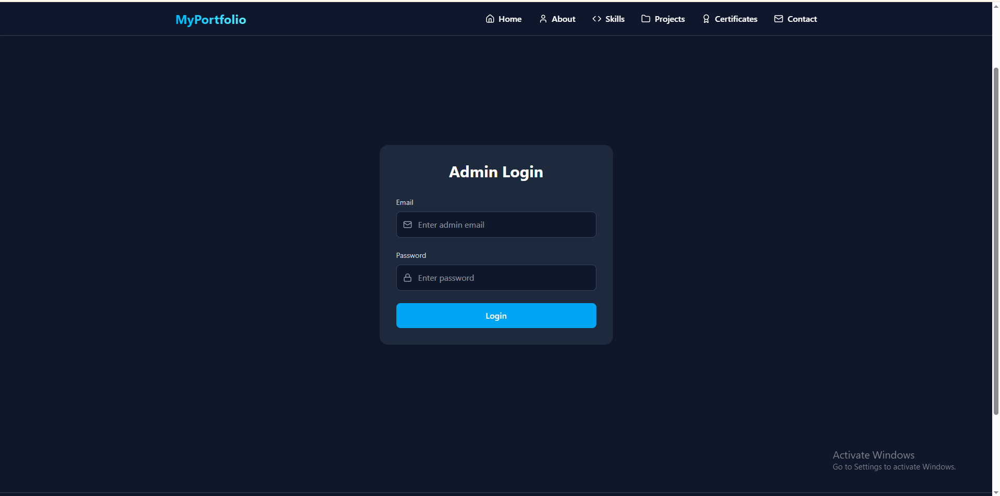
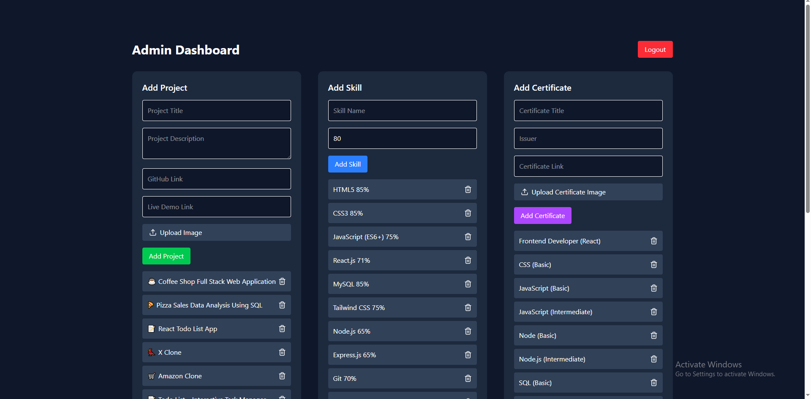

# 🌐 Full Stack Portfolio Management System

A complete **Full Stack Portfolio Web Application** built using **React, Tailwind CSS, Node.js, Express.js, JWT, and MySQL**.

This project demonstrates a **real-world developer portfolio system** with the following capabilities:

- **Secure admin authentication** using JWT
- **Dynamic project management** (Add and Delete projects)
- **Skill management system** for displaying developer skills
- **Image upload functionality** using Multer middleware
- **REST API integration** for frontend and backend communication
- **Database connectivity** using MySQL
- **Protected routes** to secure admin functionality
- **Centralized error handling middleware**
- **Environment variable configuration** using `.env`
- **Responsive user interface** built with React and Tailwind CSS

---

## 🚀 Live Demo

Frontend:
https://mayuresh-2601.github.io/Portfolio

GitHub Repository:
https://github.com/mayuresh-2601/Portfolio

---

## 📌 Project Overview

This application represents a **modern full stack developer portfolio system** that allows users and administrators to interact with portfolio data dynamically.

Users can:

- View developer profile information
- Explore skills and projects
- Submit contact messages
- Navigate through a responsive portfolio interface

Administrators can:

- Access secure admin login
- Manage projects and skills
- Upload project images
- Update portfolio content dynamically
- Store and retrieve data from a MySQL database

---

## 🎯 Purpose of the Project

The project is designed as a **portfolio-ready full stack system** to demonstrate real-world development skills and practical application architecture.

It is suitable for:

- Internship roles
- Junior Developer roles
- Entry-Level Full Stack Developer positions
- Full Stack Developer portfolio showcase
- Technical interview demonstrations

## 📸 Application Screenshots

---

## 👤 User Interface — Portfolio Pages

### 🏠 Home Page

This is the main landing page where users can view the developer introduction, skills highlights, and navigation options.



---

### 🏠 Admin Home Page

This page appears after admin login and allows the administrator to manage projects, skills, and portfolio content securely.



---

### 👤 About Page

This page provides background information about the developer, experience, and technical expertise.



---

### 📞 Contact Page

Users can use this page to send messages or connect with the developer.



---

## 🔐 Admin Interface — Secure Management Panel

### 🔐 Admin Login Page

This is the secure authentication page for administrators.  
Only authorized users can access the admin dashboard.



---

### 📊 Admin Dashboard

This dashboard allows administrators to manage portfolio content dynamically.

Admin can:

- Add new projects
- Delete projects
- Upload project images
- Add skills
- Delete skills
- Manage portfolio data securely



---
---

## 🛠️ Technologies Used

### Frontend

- React
- React Router
- Tailwind CSS
- Axios
- Responsive Design
- Component-based UI

### Backend

- Node.js
- Express.js
- RESTful API
- JWT Authentication
- Middleware
- Multer (File Upload Handling)

### Database

- MySQL
- SQL Queries
- Relational Database Management

### Tools & Development Environment

- Git
- GitHub
- Visual Studio Code (VS Code)
- Nodemon
- Postman

---

## 🎯 Key Features

### 👤 User Features

- Responsive portfolio website
- Dynamic project listing
- Dynamic skills display
- Contact form submission
- Modern and clean user interface
- Mobile-friendly responsive design

### 🔐 Admin Features

- Secure admin login authentication
- Add new projects
- Delete existing projects
- Add new skills
- Delete skills
- Upload project images
- Protected admin dashboard
- Secure API access control

### ⚙️ System Features

- REST API architecture
- JWT-based authentication
- Protected routes using middleware
- File upload system using Multer
- Environment variable configuration using `.env`
- Centralized error handling middleware
- Database connection pooling
- Scalable backend structure (MVC pattern)

---

## 📂 Project Structure

```

my-portfolio
│
├── backend
│   │
│   ├── config
│   │   └── db.js
│   │
│   ├── controllers
│   │   ├── authController.js
│   │   ├── projectController.js
│   │   └── skillController.js
│   │
│   ├── database
│   │   └── portfolio_db.sql
│   │
│   ├── middleware
│   │   ├── authMiddleware.js
│   │   ├── errorMiddleware.js
│   │   └── uploadMiddleware.js
│   │
│   ├── models
│   │   ├── projectModel.js
│   │   ├── skillModel.js
│   │   └── userModel.js
│   │
│   ├── routes
│   │   ├── authRoutes.js
│   │   ├── projectRoutes.js
│   │   └── skillRoutes.js
│   │
│   ├── uploads
│   │
│   ├── .env
│   ├── package.json
│   ├── package-lock.json
│   └── server.js
│
├── public
│
├── src
│   │
│   ├── api
│   │   └── axios.js
│   │
│   ├── assets
│   │
│   ├── components
│   │
│   ├── pages
│   │   ├── Home.jsx
│   │   ├── About.jsx
│   │   ├── Skills.jsx
│   │   ├── Projects.jsx
│   │   ├── Contact.jsx
│   │   ├── AdminLogin.jsx
│   │   └── AdminDashboard.jsx
│   │
│   ├── App.jsx
│   ├── App.css
│   ├── index.css
│   └── main.jsx
│
├── index.html
├── package.json
├── package-lock.json
├── vite.config.js
├── README.md
└── .gitignore

```
---

## ⚙️ Installation & Setup

Follow the steps below to run the project locally.

---

### Step 1 — Clone Repository

```
git clone https://github.com/mayuresh-2601/Portfolio.git
```

---

### Step 2 — Navigate to Project

```
cd Portfolio
```

---

### Step 3 — Install Frontend Dependencies

```
npm install
```

---

### Step 4 — Install Backend Dependencies

```
cd backend
npm install
```

---

### Step 5 — Create Environment File


- Create `.env` file inside backend:
```
PORT=5000

DB_HOST=localhost
DB_USER=root
DB_PASSWORD=your_password
DB_NAME=portfolio_db

JWT_SECRET=your_secret_key
```

---

### Step 6 — Create and Import Database

- Create a MySQL database:

```
CREATE DATABASE portfolio_db;
```

- Then import the database schema:

```
mysql -u root -p portfolio_db < portfolio_db.sql
```

---

### Step 7 — Run Backend Server

```
npm run dev
```

- Backend will run on:
```
http://localhost:5000
```
---

### Step 8 — Run Frontend

```
npm run dev
```
- Frontend will run on:
```
http://localhost:5173
```
---

## 🔌 API Endpoints

- The backend provides RESTful API endpoints for authentication, project management, and skill management.

---

### 🔐 Authentication

```
POST /api/auth/login
```
---

### Projects

- GET /api/projects
- POST /api/projects
- DELETE /api/projects/:id

---

### Skills

- GET /api/skills
- POST /api/skills
- DELETE /api/skills/:id

---

## 🔐 Security Features

- Password hashing using **bcrypt**
- JWT-based authentication
- Protected admin routes
- Environment variable configuration using `.env`
- File upload validation using Multer
- SQL prepared statements to prevent SQL injection
- Centralized error handling middleware

---

## 📊 Core Functionalities

### 📁 Project Management

- Add new projects
- Upload project images
- Store project data in the database
- Retrieve project information dynamically
- Delete existing projects

---

### 🧠 Skill Management

- Add new skills
- Display skills dynamically on the frontend
- Delete skills from the system

---

### 🔐 Authentication

- Admin login verification
- Token-based authentication using JWT
- Protected routes using middleware
- Secure access to admin dashboard

---

## 📈 What This Project Demonstrates

- Full Stack Web Development
- React Application Development
- REST API Development
- Backend Architecture using Node.js and Express
- Database Integration with MySQL
- Authentication and Authorization
- File Upload Handling
- Git Version Control
- Debugging and Problem Solving
- MVC (Model-View-Controller) Architecture

---

## 🔮 Future Improvements

- Edit project functionality
- User registration system
- Contact message management dashboard
- Dark mode toggle feature
- Email notification system
- Role-based authentication (Admin/User)
- Cloud deployment (Render / Vercel / AWS)
- Pagination for projects and skills

---

## 👨‍💻 Author

Mayuresh Kasar
Full Stack Web Developer

GitHub:
https://github.com/mayuresh-2601

---

## ⭐ Support

If you found this project helpful, please give it a ⭐ on GitHub.
